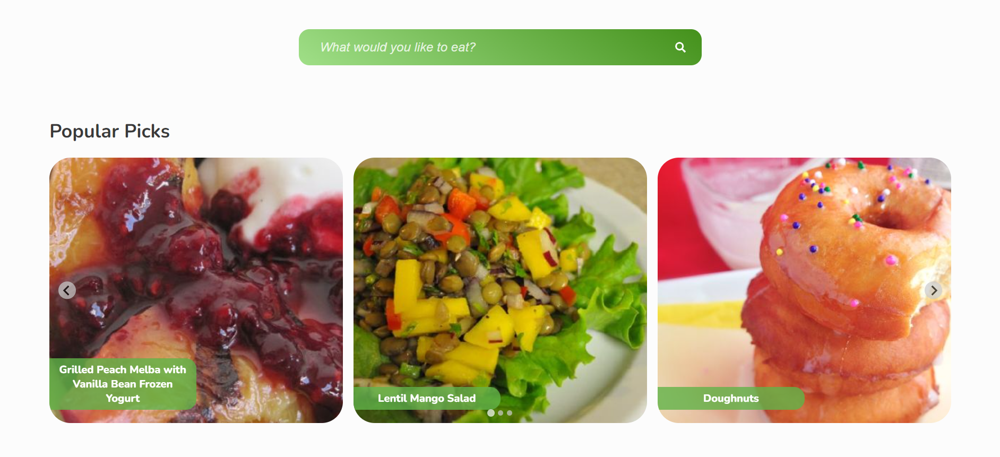
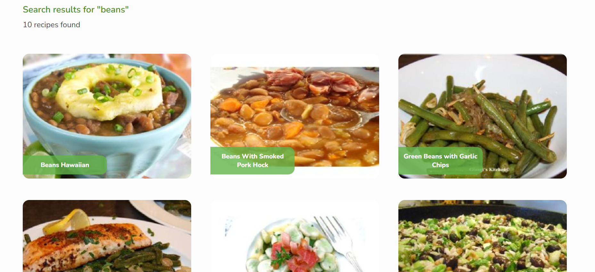
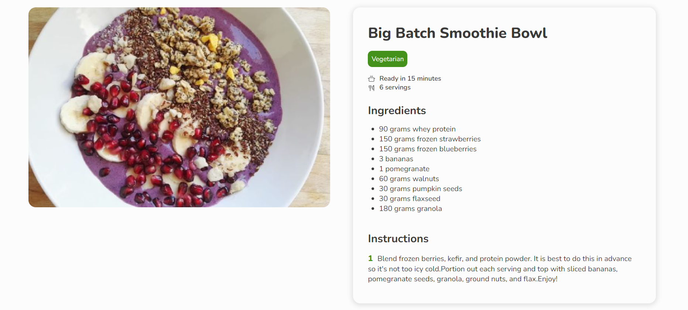

# Veggielicious

This React project, developed as part of the Start2Impact course, is designed to contribute to the reduction of meat consumption in the diet. 

It incorporates modern web development practices, such as component-based architecture, state management, and responsive design principles.

## Link to Veggielicious (Netlify App)

[Find hundreds of vegetarian recipes!](https://veggielicious-react-project.netlify.app/)

## Technologies Used:
- React.js
- React Router
- React Hooks
- JSX
- Styled Components
- Fetch API

## Screenshots

This is how Veggielicious looks like:

#### Screenshot 1

#### Screenshot 2

#### Screenshot 3

## Contribution:

#### Contributions are welcome! If you'd like to contribute to the project, please follow these guidelines:

- Fork the repository.
- Create a new branch (git checkout -b feature/your-feature).
- Commit your changes (git commit -am 'Add some feature').
- Push to the branch (git push origin feature/your-feature).
- Create a new Pull Request.
